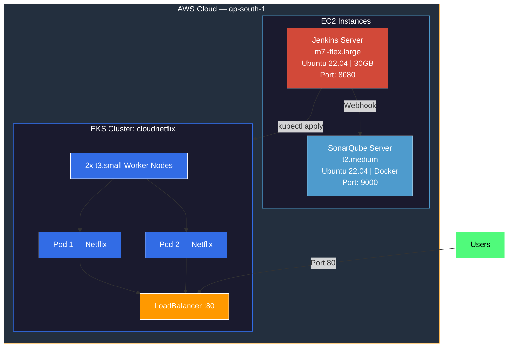

<div align="center">

# Netflix Clone — DevSecOps CI/CD on AWS EKS

### *Fully automated, security-first deployment pipeline from code push to production*

<br>

[](https://www.jenkins.io/)
[](https://www.docker.com/)
[](https://kubernetes.io/)
[](https://aws.amazon.com/)
[](https://www.sonarqube.org/)
[](https://trivy.dev/)

<br>


</div>

---

## Project Overview

This project demonstrates a production-grade **DevSecOps CI/CD pipeline** that automatically **builds**, **scans**, and **deploys** a Netflix Clone application to **AWS Elastic Kubernetes Service (EKS)** on every code push — with **security integrated at every stage**.

### Key Highlights

- **Security-first** — Trivy scans for both filesystem & container image vulnerabilities
- **Code Quality** — SonarQube enforces quality gates before deployment
- **Kubernetes-native** — deployed on AWS EKS with LoadBalancer access
- **Fully Automated** — end-to-end pipeline triggered on every `git push`
- **Containerized** — Docker image built, scanned & pushed to Docker Hub

---

## Architecture

```mermaid
graph LR
    A["GitHub Push"] --> B["Jenkins CI/CD"]
    B --> C["SonarQube Analysis"]
    C --> D["Quality Gate"]
    D --> E["npm install"]
    E --> F["Trivy FS Scan"]
    F --> G["Docker Build & Push"]
    G --> H["Trivy Image Scan"]
    H --> I["Deploy to AWS EKS"]

    style A fill:#24292e,stroke:#fff,color:#fff
    style B fill:#D24939,stroke:#fff,color:#fff
    style C fill:#4E9BCD,stroke:#fff,color:#fff
    style D fill:#4E9BCD,stroke:#fff,color:#fff
    style E fill:#339933,stroke:#fff,color:#fff
    style F fill:#1904DA,stroke:#fff,color:#fff
    style G fill:#2496ED,stroke:#fff,color:#fff
    style H fill:#1904DA,stroke:#fff,color:#fff
    style I fill:#FF9900,stroke:#fff,color:#fff
```



---

## Tech Stack

<table>
<tr>
<th>Category</th>
<th>Tool</th>
<th>Purpose</th>
</tr>
<tr><td rowspan="1"><b>CI/CD</b></td><td>Jenkins</td><td>Pipeline automation & orchestration</td></tr>
<tr><td rowspan="2"><b>Security</b></td><td>SonarQube</td><td>Static code analysis, bug & vulnerability detection</td></tr>
<tr><td>Trivy</td><td>Filesystem & container image vulnerability scanning</td></tr>
<tr><td rowspan="2"><b>Containers</b></td><td>Docker</td><td>Containerization of the application</td></tr>
<tr><td>Docker Hub</td><td>Container image registry</td></tr>
<tr><td rowspan="4"><b>Cloud (AWS)</b></td><td>EC2</td><td>Hosting Jenkins & SonarQube servers</td></tr>
<tr><td>EKS</td><td>Managed Kubernetes cluster for deployment</td></tr>
<tr><td>IAM</td><td>Secure access management</td></tr>
<tr><td>LoadBalancer</td><td>Public-facing application access</td></tr>
<tr><td rowspan="3"><b>CLI Tools</b></td><td>kubectl</td><td>Kubernetes cluster management</td></tr>
<tr><td>eksctl</td><td>EKS cluster provisioning</td></tr>
<tr><td>AWS CLI</td><td>AWS service interaction</td></tr>
<tr><td><b>Runtime</b></td><td>Node.js</td><td>Application runtime environment</td></tr>
</table>

---

## CI/CD Pipeline — Stage Breakdown

| # | Stage | Description | Tool(s) |
|:-:|-------|-------------|---------|
| 1 | **Clean Workspace** | Removes previous build artifacts for a fresh start | Jenkins |
| 2 | **Checkout from Git** | Pulls the latest code from the GitHub repository | Git |
| 3 | **SonarQube Analysis** | Scans for bugs, vulnerabilities, and code smells | SonarQube |
| 4 | **Quality Gate** | Waits for SonarQube pass/fail via webhook callback | SonarQube |
| 5 | **Install Dependencies** | Runs `npm install` to fetch project dependencies | Node.js / npm |
| 6 | **Trivy FS Scan** | Scans the entire filesystem for known vulnerabilities | Trivy |
| 7 | **Docker Build & Push** | Builds the image (with TMDB API key) and pushes to Docker Hub | Docker |
| 8 | **Trivy Image Scan** | Scans the final Docker image for CVEs before deployment | Trivy |
| 9 | **Deploy to EKS** | Applies Kubernetes manifests and exposes via LoadBalancer | kubectl / EKS |

---

## Infrastructure Setup



---

## Prerequisites

Before getting started, ensure you have the following:

| Requirement | Details |
|-------------|---------|
| **AWS Account** | With IAM permissions for EC2, EKS, and IAM management |
| **Docker Hub Account** | For pushing and pulling container images |
| **GitHub Account** | To host and version control the project repository |
| **TMDB API Key** | Free API key from [themoviedb.org](https://www.themoviedb.org) for movie data |

---

## Step-by-Step Setup Guide

### Step 1 — Launch EC2 Instances

Create **two EC2 instances** on AWS:

| Instance | Type | OS | Storage | Open Ports |
|----------|------|----|---------|------------|
| **Jenkins Server** | `m7i-flex.large` (8GB RAM min) | Ubuntu 22.04 | 30GB | `8080`, `22` |
| **SonarQube Server** | `t2.medium` | Ubuntu 22.04 | Default | `9000`, `22` |

> [!IMPORTANT]
> Allocate at least **30GB of storage** for the Jenkins server. Docker images and the Trivy vulnerability DB alone can consume ~6GB.

---

### Step 2 — Install Tools on Jenkins Server

SSH into the Jenkins EC2 instance and run the following:

<details>
<summary><b>Install Java 17</b></summary>

```bash
sudo apt update -y
sudo apt install openjdk-17-jre -y
java -version
```
</details>

<details>
<summary><b>Install Jenkins</b></summary>

```bash
sudo wget -O /usr/share/keyrings/jenkins-keyring.asc \
  https://pkg.jenkins.io/debian-stable/jenkins.io-2023.key

echo deb [signed-by=/usr/share/keyrings/jenkins-keyring.asc] \
  https://pkg.jenkins.io/debian-stable binary/ | sudo tee \
  /etc/apt/sources.list.d/jenkins.list > /dev/null

sudo apt-get update && sudo apt-get install jenkins -y
sudo systemctl enable jenkins && sudo systemctl start jenkins
```
</details>

<details>
<summary><b>Install Docker</b></summary>

```bash
sudo apt install docker.io -y
sudo usermod -aG docker ubuntu
sudo usermod -aG docker jenkins
sudo chmod 777 /var/run/docker.sock
```
</details>

<details>
<summary><b>Install AWS CLI</b></summary>

```bash
curl "https://awscli.amazonaws.com/awscliv2.zip" -o "awscliv2.zip"
unzip awscliv2.zip && sudo ./aws/install
aws --version
```
</details>

<details>
<summary><b>Install kubectl</b></summary>

```bash
curl -LO "https://dl.k8s.io/release/$(curl -L -s \
  https://dl.k8s.io/release/stable.txt)/bin/linux/amd64/kubectl"
chmod +x kubectl && sudo mv kubectl /usr/local/bin/
kubectl version --client
```
</details>

<details>
<summary><b>Install eksctl</b></summary>

```bash
curl --silent --location \
  "https://github.com/weaveworks/eksctl/releases/latest/download/eksctl_$(uname -s)_amd64.tar.gz" \
  | tar xz -C /tmp
sudo mv /tmp/eksctl /usr/local/bin
eksctl version
```
</details>

<details>
<summary><b>Install Trivy</b></summary>

```bash
sudo apt-get install wget apt-transport-https gnupg lsb-release -y
wget -qO - https://aquasecurity.github.io/trivy-repo/deb/public.key | sudo apt-key add -
echo deb https://aquasecurity.github.io/trivy-repo/deb $(lsb_release -sc) main \
  | sudo tee -a /etc/apt/sources.list.d/trivy.list
sudo apt-get update && sudo apt-get install trivy -y
trivy --version
```
</details>

---

### Step 3 — Set Up SonarQube Server

SSH into the SonarQube EC2 instance:

```bash
sudo apt install docker.io -y
sudo usermod -aG docker ubuntu
sudo chmod 777 /var/run/docker.sock
docker run -d --name sonarqube -p 9000:9000 sonarqube:lts-community
```

> [!NOTE]
> SonarQube takes ~1–2 minutes to fully start. Wait before accessing the UI.

---

### Step 4 — Configure SonarQube

1. Navigate to `http://<SonarQube-Public-IP>:9000`
2. Login with default credentials: `admin` / `admin` (change on first login)
3. **Generate a token:**
   - Go to → `My Account` → `Security` → `Generate Tokens`
   - Copy the token — you'll need it in Jenkins
4. **Create a webhook for Jenkins:**
   - Go to → `Administration` → `Configuration` → `Webhooks` → `Create`
   - **URL:** `http://<Jenkins-Public-IP>:8080/sonarqube-webhook/`

> [!WARNING]
> The webhook is **mandatory** for the Quality Gate stage to work. Without it, the pipeline will hang indefinitely waiting for a callback.

---

### Step 5 — Create EKS Cluster

Back on the **Jenkins server**, configure AWS CLI and create the cluster:

```bash
# Configure AWS credentials
aws configure
# Enter: Access Key ID, Secret Key, Region (ap-south-1), Output (json)

# Create the EKS cluster (takes ~15-20 minutes)
eksctl create cluster \
  --name cloudnetflix \
  --region ap-south-1 \
  --node-type t3.small \
  --nodes 2 \
  --managed

# Verify the cluster
kubectl get nodes

# Copy kubeconfig to Jenkins user so the pipeline can access the cluster
sudo mkdir -p /var/lib/jenkins/.kube
sudo cp /home/ubuntu/.kube/config /var/lib/jenkins/.kube/config
sudo chown -R jenkins:jenkins /var/lib/jenkins/.kube
```

> [!TIP]
> Use `t3.small` instances for learning projects to stay within free tier limits and avoid vCPU quota issues.

---

### Step 6 — Configure Jenkins

**6.1 — Install Required Plugins**

Navigate to `Manage Jenkins` → `Plugins` → `Available Plugins` and install:

| Plugin | Purpose |
|--------|---------|
| `SonarQube Scanner` | Integrates SonarQube analysis |
| `NodeJS` | Provides Node.js build environment |
| `Docker Pipeline` | Enables Docker commands in pipeline |
| `Kubernetes CLI` | kubectl integration |
| `Email Extension` | Build notification emails |

**6.2 — Add Credentials**

Navigate to `Manage Jenkins` → `Credentials` → `Global` → `Add Credentials`:

| Credential ID | Type | Description |
|----------------|------|-------------|
| `github-token` | Secret text | GitHub personal access token |
| `sonar-token` | Secret text | SonarQube authentication token |
| `docker` | Username with password | Docker Hub login credentials |
| `aws-access` | Secret text | AWS Access Key ID |
| `aws-secret` | Secret text | AWS Secret Access Key |

**6.3 — Configure SonarQube Server**

Navigate to `Manage Jenkins` → `System` → `SonarQube servers`:
- **Name:** `sonarqube`
- **Server URL:** `http://<SonarQube-Public-IP>:9000`
- **Server authentication token:** Select the `sonar-token` credential

---

### Step 7 — Create & Run the Pipeline

1. Go to `Jenkins Dashboard` → `New Item`
2. Enter a name (e.g., `netflix-pipeline`) → Select **Pipeline** → Click **OK**
3. Under **Pipeline**:
   - **Definition:** Pipeline script from SCM
   - **SCM:** Git
   - **Repository URL:** `https://github.com/<your-username>/netflix-devsecops-eks.git`
   - **Branch:** `*/main`
   - **Script Path:** `Jenkinsfile`
4. Click **Save** → Click **Build Now**

---

## Key Configuration Files

### `Jenkinsfile`

```groovy
pipeline {
    agent any
    tools {
        jdk 'jdk17'
        nodejs 'node18'
    }
    environment {
        SCANNER_HOME = tool 'sonar-scanner'
    }

    stages {
        stage('Clean Workspace') {
            steps { cleanWs() }
        }

        stage('Checkout from Git') {
            steps {
                git branch: 'main', url: 'YOUR_REPO_URL'
            }
        }

        stage('SonarQube Analysis') {
            steps {
                withSonarQubeEnv('sonarqube') {
                    sh '''$SCANNER_HOME/bin/sonar-scanner \
                        -Dsonar.projectName=netflix \
                        -Dsonar.projectKey=netflix'''
                }
            }
        }

        stage('Quality Gate') {
            steps {
                script {
                    waitForQualityGate abortPipeline: false, credentialsId: 'sonar-token'
                }
            }
        }

        stage('Install Dependencies') {
            steps { sh 'npm install' }
        }

        stage('TRIVY FS Scan') {
            steps { sh 'trivy fs . > trivyfs.txt' }
        }

        stage('Docker Build & Push') {
            steps {
                script {
                    withDockerRegistry(credentialsId: 'docker', url: 'https://index.docker.io/v1/') {
                        sh 'docker build --build-arg TMDB_V3_API_KEY=YOUR_KEY -t netflix .'
                        sh 'docker tag netflix YOUR_DOCKERHUB/netflix:latest'
                        sh 'docker push YOUR_DOCKERHUB/netflix:latest'
                    }
                }
            }
        }

        stage('TRIVY Image Scan') {
            steps { sh 'trivy image YOUR_DOCKERHUB/netflix:latest > trivyimage.txt' }
        }

        stage('Deploy to EKS') {
            steps {
                withCredentials([
                    string(credentialsId: 'aws-access', variable: 'AWS_ACCESS_KEY_ID'),
                    string(credentialsId: 'aws-secret', variable: 'AWS_SECRET_ACCESS_KEY')
                ]) {
                    sh '''
                        export AWS_DEFAULT_REGION=ap-south-1
                        aws eks update-kubeconfig --region ap-south-1 --name cloudnetflix
                        kubectl apply -f deployment.yml
                        kubectl get pods
                        kubectl get svc
                    '''
                }
            }
        }
    }

    post {
        always {
            echo 'Pipeline execution complete.'
        }
        success {
            echo ' Pipeline succeeded! Application deployed to EKS.'
        }
        failure {
            echo ' Pipeline failed. Check logs for details.'
        }
    }
}
```

---

### `deployment.yml`

```yaml
---
apiVersion: apps/v1
kind: Deployment
metadata:
  name: netflix-deployment
  labels:
    app: netflix
spec:
  replicas: 2
  selector:
    matchLabels:
      app: netflix
  template:
    metadata:
      labels:
        app: netflix
    spec:
      containers:
        - name: netflix
          image: YOUR_DOCKERHUB/netflix:latest
          ports:
            - containerPort: 80
          resources:
            requests:
              cpu: "100m"
              memory: "128Mi"
            limits:
              cpu: "250m"
              memory: "256Mi"

---
apiVersion: v1
kind: Service
metadata:
  name: netflix-service
spec:
  selector:
    app: netflix
  type: LoadBalancer
  ports:
    - protocol: TCP
      port: 80
      targetPort: 80
```

---

## Security Measures

This project implements **security at every layer** of the pipeline:

| Layer | Measure | Description |
|-------|---------|-------------|
| **Source Code** | SonarQube Analysis | Detects bugs, vulnerabilities, and code smells |
| **Quality** | SonarQube Quality Gate | Blocks deployments if quality thresholds are not met |
| **Dependencies** | Trivy FS Scan | Scans `node_modules` and project files for known CVEs |
| **Container** | Trivy Image Scan | Scans the final Docker image before deployment |
| **Secrets** | Jenkins Credential Store | Zero hardcoded secrets in pipeline or application code |
| **Access** | IAM Least Privilege | Dedicated IAM user with only EKS-required permissions |

---

## Pipeline Results

| Metric | Status |
|--------|--------|
| **Pipeline Status** | SUCCESS |
| **EKS Cluster** | Running in `ap-south-1` |
| **Docker Image** | Pushed to Docker Hub (`netflix:latest`) |
| **Running Pods** | 2 Replicas Active |
| **SonarQube Quality Gate** | PASSED |
| **Trivy Scan** | Filesystem & Image — Scanned |
| **Application Access** | AWS LoadBalancer (Port 80) |

---

## Screenshots

> **TODO:** Add screenshots to a `screenshots/` folder in your repository and reference them below.

<!-- Uncomment and update paths once you have screenshots:
| Jenkins Stage View | SonarQube Dashboard |
|:--:|:--:|
|  |  |

| Trivy Scan Results | Live Application |
|:--:|:--:|
|  |  |
-->

---

## Lessons Learned & Tips

> [!TIP]
> These are real-world lessons from building this project — save yourself some debugging time!

| Issue | Solution |
|-------|----------|
| EKS node creation failing | EC2 vCPU limits may be hit — use `t3.small` for learning; request a quota increase for production |
| Docker build running out of space | Expand EC2 root volume to **30GB minimum** — Docker images + Trivy DB consume ~6GB |
| Quality Gate stage hangs forever | SonarQube webhook is **mandatory** — configure it in Step 4 |
| Jenkins can't reach SonarQube after reboot | EC2 public IPs change on restart — update SonarQube URL in Jenkins System config or use Elastic IPs |
| `kubectl` commands fail in pipeline | Ensure kubeconfig is copied to `/var/lib/jenkins/.kube/config` and owned by `jenkins` user |

---

## Cleanup (Avoid Unnecessary Charges!)

> [!CAUTION]
> **The EKS cluster is the most expensive resource.** Delete it immediately when you're done to avoid unexpected AWS charges.

```bash
# 1. Delete the EKS cluster (this is the most important step)
eksctl delete cluster --name cloudnetflix --region ap-south-1

# 2. Terminate EC2 instances via AWS Console
#    → EC2 → Instances → Select → Instance State → Terminate

# 3. Remove IAM access keys
#    → IAM → Users → Select user → Security Credentials → Delete keys

# 4. Clean up Docker Hub (optional)
#    → Docker Hub → Repositories → Delete netflix image
```

---

## Project Structure

```
netflix-devsecops-eks/
├── Jenkinsfile              # CI/CD pipeline definition
├── Dockerfile               # Container image build instructions
├── deployment.yml           # Kubernetes deployment & service manifests
├── package.json             # Node.js dependencies
├── src/                     # Application source code
├── public/                  # Static assets
├── screenshots/             # Pipeline & app screenshots
└── README.md                # Project documentation (this file)
```

---

## Contributing

Contributions are welcome! If you have improvements or find bugs:

1. **Fork** the repository
2. **Create** a feature branch (`git checkout -b feature/amazing-feature`)
3. **Commit** your changes (`git commit -m 'Add amazing feature'`)
4. **Push** to the branch (`git push origin feature/amazing-feature`)
5. **Open** a Pull Request

---

## Author

<div align="center">

**AKSHAY**


*Aspiring Cloud & DevOps Engineer*

[](https://linkedin.com/in/akshay355a)
[](https://github.com/AKSHAY355-a)

</div>
